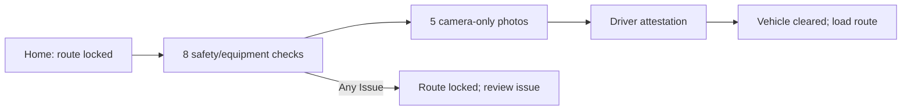
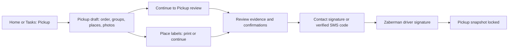
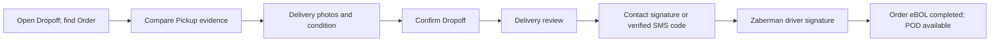
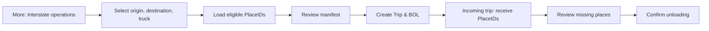

# Business overview

## Purpose and scope

The active Mobile App wireframe lets a Zaberman driver complete a required vehicle Pre-trip inspection before loading the daily route, record cargo at Pickup, verify it at Dropoff, and account for individual places during Interstate loading and unloading. It also presents the Order eBOL handoff record and the separate Interstate BOL. The app is an interactive business prototype: records, route import, photos, signatures, print results, and sync results are simulated locally in the browser. It is not connected to Spoke, a production database, camera, scanner, printer, or document delivery service. [Source: wireframe README](../../wireframe/README.md), [current state](../system-report/CURRENT_STATE.md).

## Users

The workflow is designed for the crew that records Pickup and Delivery evidence, drivers who confirm handoffs, warehouse employees who account for places, and supervisors/dispatchers who inspect or maintain order information. The Administration panel can switch a simulated role and branch. Its controls do not establish production authorization. The exact assignment and permission policy remains an internal production decision.

## Main concepts

| Concept | Meaning in the active prototype |
| --- | --- |
| Order | Shipment identified in the UI by an order number. A loaded Spoke stop's External ID becomes that number in the local route simulation. |
| Task / Stop | A scheduled Pickup or Dropoff row on Today's Spoke route, with sequence, time, address and Order. Tasks are displayed in Home and Tasks. The active router has no separate task detail screen. |
| Pre-trip inspection | Required vehicle safety checklist, five current camera photos including Dashboard and driver attestation. A passed inspection unlocks loading Today's route; any Issue keeps it locked. |
| Post-trip inspection | Eight checks including company equipment, five photo markers including Dashboard, required defect notes and driver attestation. Defects do not block reporting. Read-only results and paired history; next cycle requires fresh Pre-trip. No timekeeping or automatic order/Interstate close. |
| Pickup | An operation that records dimension groups, individual cargo places, photos and order context; it prepares Pickup evidence for Order eBOL review. |
| Dropoff | Verification of a previously recorded order against Pickup evidence, with Delivery photos and condition/exception; it prepares Delivery review. |
| Same Day | A movement type whose Pickup and Dropoff are intended to be connected through a RouteRun in the approved product model. An older Same Day screen exists in source but is not routed in the active app. |
| Interstate | A separate workflow for warehouse-to-warehouse movement of selected places: loading, manifest review, Trip creation, unloading and Interstate BOL. |
| Trip / Manifest | A selected direction, truck and confirmed set of PlaceIDs. The Trip is created after loading review; unloading reconciles against its confirmed manifest. |
| Cargo Piece / Place | The individually identified physical unit. A dimension group holds quantity and shared measurements, while each place preserves its PlaceID. |
| Warehouse / Branch / Direction | Interstate origin and destination are warehouse values; direction is the ordered origin → destination pair. The current branch and role can be changed in Administration for scenarios. |
| Scan / Barcode / QR | Scan is a PlaceID or Order ID lookup in the main Scan tab; loading/unloading also accept PlaceID. Place labels show Code 128. A separate QR workflow is not evidenced by the active UI. |
| Order eBOL / POD | One order document that progresses through Pickup and Delivery snapshots. POD is the final view after both snapshots are locked. |
| Interstate BOL | A different document belonging to an Interstate Trip and its manifest. |

The target product model gives CargoPlace an opaque UUIDv7 primary ID and treats the human label as an alias. The active wireframe instead uses readable IDs such as `ZB-{ORDER}-{NN}`; employees should use the label shown in the current UI. [Product decisions](../system-report/STAGE_0_PRODUCT_DECISIONS.md), [wireframe README](../../wireframe/README.md).

## Application structure

The active bottom navigation is **Home | Tasks | Scan | More**. Home offers Pickup, Dropoff, the required Pre-trip inspection, Today's Spoke route, Order documents, Pickup drafts and Recent operations. Tasks filters the loaded route by All, Pickup or Dropoff and searches Order ID/title. Scan looks up a place or an order. More contains Help & Instructions, Sync now, Interstate operations, Cargo places, Administration and device availability. The active hash routes are listed in [App.tsx](../../wireframe/src/App.tsx). Administration is a scenario control surface, not an everyday operational step.

## Business workflows

### Pre-trip inspection and route gate

The sample vehicle is **Van 08 · Extended Van** at NJ1. Every check needs Pass or Issue, and Front, Rear, Driver side, Passenger side and Dashboard photos must be taken in the flow. Gallery upload is not offered. Any Issue or unavailable camera prevents completion. The active wireframe persists the inspection locally and has no assignment service, maintenance task, supervisor override or server audit. [Pre-trip source](../../wireframe/src/screens/PreTripInspectionScreen.tsx), [documented scope](../system-report/PRE_TRIP_INSPECTION_WIREFRAME.md).

### Pickup and Order eBOL

The Pickup draft autosaves. The employee may add, change or remove dimension groups, record quantity, L/W/H, weight per place, reason for unknown measurements, photos, and order context. Saving creates or updates the local Order eBOL draft and a local cargo record. It does **not** lock the Pickup snapshot. Review and signing are separate steps. After locking, the original is read-only; added places use Supplemental Pickup with a new version and confirmations. [Pickup screen](../../wireframe/src/screens/PickupCaptureScreen.tsx), [Pickup review](../../wireframe/src/screens/PickupEbolScreen.tsx), [signing](../../wireframe/src/screens/PickupSignatureScreen.tsx).

### Customer SMS

Customer messaging is Order-scoped rather than a separate operational lifecycle. Employees can enter the same conversation from Home Messages, a task, Order details or the **SMS** action in Pickup draft. The inbox supports search and All/Unread filters; the thread offers quick messages, custom text, explicit delivery states, offline queueing and retry. The visible sender is corporate number **17178361039**, never the employee's personal number. The current implementation is local prototype state; telephony API, inbound webhook, push delivery, retention and audit remain production work.

### Dropoff and POD

The Dropoff screen requires a recorded order, matching cargo, at least one Delivery photo, and either no visible damage or a damage report with details. An unsigned Supplemental Pickup blocks confirmation. “Dropoff confirmed” records the operation; Delivery review then offers contact signature or SMS code. SMS code must be verified before the driver can sign; POD stores the confirmation method and masked phone reference, not the code. Delivery signing locks the snapshot and completes the Order eBOL. If Pickup is not yet locked, the app directs the user to Pickup review first. [Dropoff screen](../../wireframe/src/screens/DropoffVerifyScreen.tsx), [Delivery review](../../wireframe/src/screens/DeliveryEbolScreen.tsx), [POD](../../wireframe/src/screens/OrderPodScreen.tsx).

### Same Day

The approved product model links independent Pickup and Dropoff operations through a RouteRun. The active Tasks list can show both operation types, but it does not expose a dedicated Same Day route lifecycle or a guaranteed paired-order progression. The standalone Same Day component is not connected to the active router. Therefore the sequence “Pickup → Dropoff” is a **planned process model**, not an implemented one-tap Same Day workflow. See [Same Day article](../../knowledge-base/mobile-app/same-day.md).

### Interstate

Only Pickup-recorded orders matching the selected direction are eligible for loading. Employees can enter PlaceID or select places/order groups, review the selected manifest, and create a Trip with an Interstate BOL. The receiving workflow checks actual PlaceIDs against the fixed incoming manifest. If places are missing, the UI asks for explicit confirmation of discrepancies before unloading. Interstate movement and handoff to final Delivery are not simulated as a complete connected lifecycle. [Interstate domain](../../wireframe/src/interstateDomain.ts), [Interstate entry](../../wireframe/src/screens/InterstateScreen.tsx).

## Confirmed rules in the active wireframe

| Rule | Source and status |
| --- | --- |
| A Pickup can continue to review only with an Order number, at least one place, at least one photo, saved draft, complete order details, and no measurement issues. Unknown measurements need a reason. | [Pickup form](../../wireframe/src/screens/PickupCaptureScreen.tsx) — Implemented local validation. |
| The original Pickup snapshot becomes read-only after the driver confirmation. Additional places use Supplemental Pickup and new confirmations. | [Pickup signing](../../wireframe/src/screens/PickupSignatureScreen.tsx) — Implemented local state. |
| A Dropoff confirmation requires cargo matches, at least one Delivery photo, condition or documented damage, and no unsigned Supplemental Pickup. | [Dropoff form](../../wireframe/src/screens/DropoffVerifyScreen.tsx) — Implemented local validation. |
| Pickup and Delivery reviews require either an on-device contact signature or a verified SMS code. OTP is available for every handoff and must be verified before driver signing. The driver always signs. Damage requires an exception note. | [Pickup review](../../wireframe/src/screens/PickupEbolScreen.tsx), [Delivery review](../../wireframe/src/screens/DeliveryEbolScreen.tsx) — Implemented local validation. |
| POD is available only after both snapshots are locked. | [POD screen](../../wireframe/src/screens/OrderPodScreen.tsx) — Implemented local guard. |
| Main Scan is lookup only: scanning does not add or move cargo. It distinguishes found, repeat during the current visit, order match, and unknown code. | [Scan screen](../../wireframe/src/screens/ScanScreen.tsx), [scan domain](../../wireframe/src/placeScanDomain.ts) — Implemented simulation. |
| Interstate loading uses eligible recorded orders and freezes only confirmed selected places into the Trip manifest. | [Interstate domain](../../wireframe/src/interstateDomain.ts), [review screen](../../wireframe/src/screens/InterstateReviewScreen.tsx) — Implemented local state. |
| Unloading is reconciled to the manifest; missing places need explicit confirmation before closing in the UI. | [Unloading screen](../../wireframe/src/screens/InterstateUnloadingScreen.tsx) — Implemented local state. |

These are rules of the current wireframe. Production server validation, permissions, synchronization, device behavior and legal document effect remain outside this implementation. The approved future rules in [Stage 0 product decisions](../system-report/STAGE_0_PRODUCT_DECISIONS.md) should not be read as already enforced by the UI.
