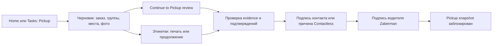
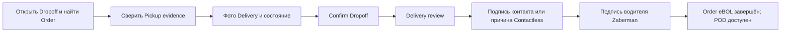
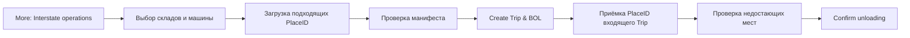

# Бизнес-обзор

## Назначение и границы

Mobile App позволяет сотруднику Zaberman зафиксировать состав и состояние груза при Pickup, сверить его при Dropoff и учитывать каждое место при загрузке и разгрузке Interstate. В приложении показаны документ передачи одного заказа — Order eBOL — и отдельный документ рейса Interstate BOL.

Это интерактивный бизнес-прототип. Записи, загрузка маршрута, фотографии, подписи, результаты печати и синхронизации имитируются в браузере. Приложение не подключено к Spoke, производственной базе данных, камере, сканеру, принтеру или сервису отправки документов. Источники: [README прототипа](../../../wireframe/README.md), [текущее состояние](../../system-report/CURRENT_STATE.md).

## Пользователи

Сценарии рассчитаны на экипаж, который фиксирует Pickup и Delivery evidence; водителя, подтверждающего передачу; сотрудника склада, учитывающего места; supervisor и dispatcher, которые просматривают или поддерживают данные заказа. В More → Administration можно переключить демонстрационные роль и филиал. Эти настройки не являются производственной системой прав. Правила назначения задач и полномочий остаются внутренним production-решением.

## Основные понятия

| Понятие | Значение в активном прототипе |
| --- | --- |
| Order | Заказ с номером в интерфейсе. В локальной имитации маршрута External ID остановки Spoke становится номером заказа Zaberman. |
| Task / Stop | Запланированная остановка Pickup или Dropoff с порядком, временем, адресом и заказом. Отображается в Home и Tasks; отдельного экрана деталей задачи в активном роутере нет. |
| Pickup | Операция фиксации групп размеров, отдельных мест, фото и контекста заказа. Подготавливает Pickup evidence для Order eBOL. |
| Dropoff | Сверка ранее записанного заказа с Pickup evidence, фиксация фото Delivery, состояния и исключений. Подготавливает Delivery review. |
| Same Day | Тип перевозки, в котором отдельные Pickup и Dropoff должны связываться через RouteRun согласно принятой продуктовой модели. Старый экран Same Day есть в коде, но не подключён к активной навигации. |
| Interstate | Отдельный процесс перемещения выбранных мест между складами: загрузка, проверка манифеста, создание Trip, разгрузка и Interstate BOL. |
| Trip / Manifest | Рейс с направлением, машиной и подтверждённым набором PlaceID. Разгрузка сверяется с зафиксированным манифестом. |
| Cargo Piece / Place | Отдельная физическая единица груза. Группа размеров хранит количество и общие измерения, а каждое место сохраняет собственный PlaceID. |
| Warehouse / Branch / Direction | Начальный и конечный склады задают направление Interstate. Текущий филиал и роль переключаются в Administration для сценариев. |
| Scan / Barcode / QR | Основной Scan ищет PlaceID или Order ID; экраны загрузки и разгрузки также принимают PlaceID. Этикетки показывают Code 128. Отдельный QR-сценарий в активном UI не подтверждён. |
| Order eBOL / POD | Один документ заказа с этапами Pickup и Delivery. POD — итоговое представление после блокировки обеих записей передачи. |
| Interstate BOL | Отдельный документ одного Interstate Trip и его манифеста. |

В целевой модели первичный CargoPlace ID — непрозрачный UUIDv7, а читаемая этикетка является псевдонимом. Активный прототип использует читаемый формат `ZB-{ORDER}-{NN}`; сотрудник должен ориентироваться на код, показанный в текущем интерфейсе. [Продуктовые решения](../../system-report/STAGE_0_PRODUCT_DECISIONS.md).

## Структура приложения

Нижнее меню: **Home | Tasks | Scan | More**. Home содержит быстрый вход в Pickup/Dropoff, маршрут Today’s Spoke route, документы заказа, черновики Pickup и последние операции. Tasks фильтрует остановки по All/Pickup/Dropoff и ищет номер или название заказа. Scan ищет место или заказ. More содержит Help & Instructions, Sync now, Interstate operations, Cargo places, Administration и доступность устройств. [Активные маршруты](../../../wireframe/src/App.tsx). Administration — служебная панель сценариев, а не повседневный шаг операции.

## Бизнес-процессы

### Pickup и Order eBOL

Черновик сохраняется автоматически. Сотрудник может добавлять, менять и удалять группы размеров; вводить Qty, L/W/H, вес одного места, причину неизвестных измерений, фотографии и данные заказа. Сохранение создаёт или обновляет локальный черновик Order eBOL и запись груза, но **не блокирует** Pickup snapshot. Проверка и подпись — отдельные шаги. После подписи исходная версия доступна только для чтения; новые места оформляются как Supplemental Pickup с новой версией и подтверждениями. [Форма](../../../wireframe/src/screens/PickupCaptureScreen.tsx), [review](../../../wireframe/src/screens/PickupEbolScreen.tsx), [подпись](../../../wireframe/src/screens/PickupSignatureScreen.tsx).

### SMS клиенту

Переписка привязана к Order и не образует отдельный жизненный цикл операции. В один диалог можно войти через Messages на Home, задачу, Order details или кнопку **SMS** в Pickup draft. Inbox поддерживает поиск и фильтры All/Unread; в диалоге доступны быстрые тексты, произвольное сообщение, явные статусы доставки, offline-очередь и Retry. Видимый отправитель — корпоративный номер **17178361039**, а не личный номер сотрудника. Текущая реализация хранится локально в прототипе; API телефонии, входящий webhook, push-доставка, retention и audit остаются production-задачами.

### Dropoff и POD

Для Confirm Dropoff нужны сохранённый заказ, отметка совпадения груза, минимум одно фото Delivery и отметка отсутствия видимых повреждений либо описание повреждения. Неподписанный Supplemental Pickup блокирует подтверждение. Сообщение **Dropoff confirmed** означает сохранение операции; подпись Delivery затем блокирует запись и завершает Order eBOL. Если Pickup ещё не заблокирован, интерфейс направляет на Pickup review. [Dropoff](../../../wireframe/src/screens/DropoffVerifyScreen.tsx), [Delivery review](../../../wireframe/src/screens/DeliveryEbolScreen.tsx), [POD](../../../wireframe/src/screens/OrderPodScreen.tsx).

### Same Day

В принятой продуктовой модели отдельные операции Pickup и Dropoff связывает RouteRun. Активный список Tasks может показывать оба типа остановок, но не содержит отдельного жизненного цикла Same Day и не гарантирует автоматическую пару задач одного заказа. Компонент Same Day не подключён к роутеру. Последовательность Pickup → Dropoff здесь является **целевой моделью процесса**, а не готовым единым сценарием. См. [статью Same Day](../../../knowledge-base/mobile-app/ru/same-day.md).

### Interstate

В загрузку попадают только заказы с записанным Pickup, соответствующие выбранному направлению. Сотрудник вводит PlaceID или выбирает места, проверяет манифест и создаёт Trip с Interstate BOL. Приёмка сверяет фактические места с зафиксированным манифестом. Недостающие места требуют явного подтверждения расхождения. Полный путь от Interstate до последующей Delivery в активном UI не связан. [Доменная логика](../../../wireframe/src/interstateDomain.ts), [экран Interstate](../../../wireframe/src/screens/InterstateScreen.tsx).

## Подтверждённые правила активного прототипа

| Правило | Источник и статус |
| --- | --- |
| Продолжить Pickup review можно при наличии номера заказа, минимум одного места и фото, сохранённого черновика, необходимых данных заказа и отсутствии ошибок измерений. Для неизвестных измерений нужна причина. | [Форма Pickup](../../../wireframe/src/screens/PickupCaptureScreen.tsx) — локальная проверка реализована. |
| Исходный Pickup snapshot после подтверждения водителем становится неизменяемым. Дополнительные места требуют Supplemental Pickup и новых подписей. | [Подписание Pickup](../../../wireframe/src/screens/PickupSignatureScreen.tsx) — локальное состояние реализовано. |
| Confirm Dropoff требует отметки совпадения груза, фото Delivery, состояния или описанного повреждения и отсутствия неподписанного Supplemental Pickup. | [Форма Dropoff](../../../wireframe/src/screens/DropoffVerifyScreen.tsx) — локальная проверка реализована. |
| Review требует данных подписантов. Contactless требует причины и подтверждения; водитель всё равно подписывает. Повреждение требует описания исключения. | [Pickup review](../../../wireframe/src/screens/PickupEbolScreen.tsx), [Delivery review](../../../wireframe/src/screens/DeliveryEbolScreen.tsx) — локальная проверка реализована. |
| POD доступен после блокировки обеих записей передачи. | [Экран POD](../../../wireframe/src/screens/OrderPodScreen.tsx) — проверка реализована. |
| Основной Scan только ищет: не добавляет и не перемещает груз. Он различает найденный, повторно считанный, номер заказа и неизвестный код. | [Scan](../../../wireframe/src/screens/ScanScreen.tsx) — симуляция реализована. |
| Загрузка Interstate выбирает подходящие заказы и фиксирует подтверждённые места в манифесте Trip. | [Логика Interstate](../../../wireframe/src/interstateDomain.ts) — локальное состояние реализовано. |
| Разгрузка сверяется с манифестом; недостающие места требуют подтверждения перед закрытием в UI. | [Unloading](../../../wireframe/src/screens/InterstateUnloadingScreen.tsx) — локальное состояние реализовано. |

Это правила текущего прототипа. Производственные серверные проверки, права, синхронизация, оборудование и юридическая сила документов пока отсутствуют. [Принятые целевые решения](../../system-report/STAGE_0_PRODUCT_DECISIONS.md) нельзя считать уже реализованными в интерфейсе.
