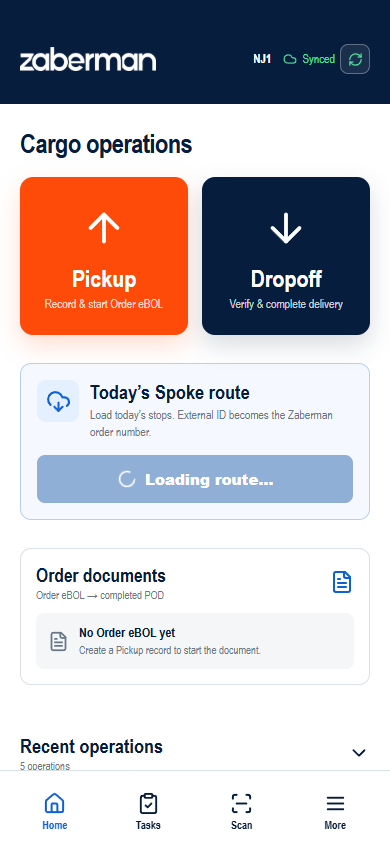
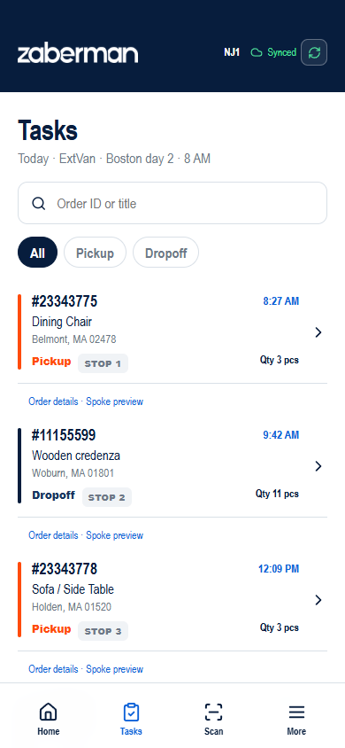
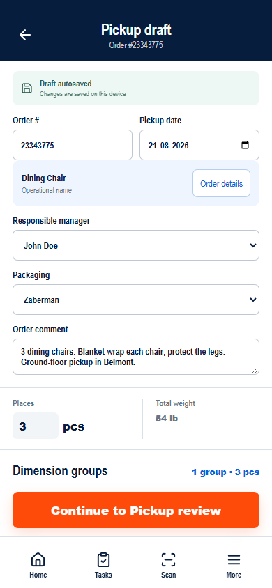
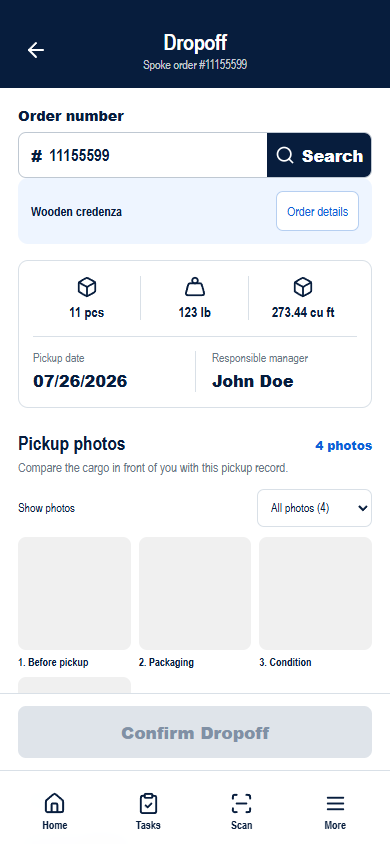
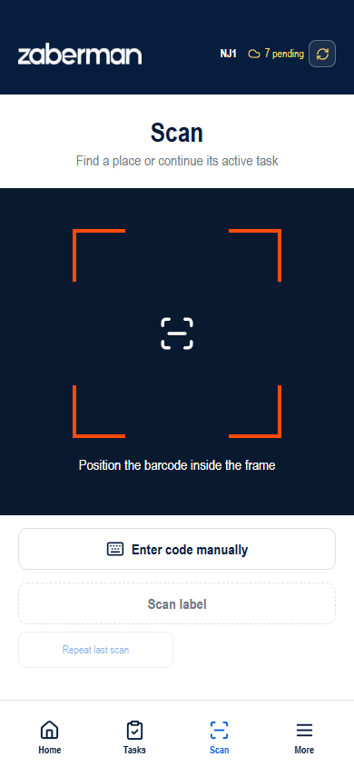
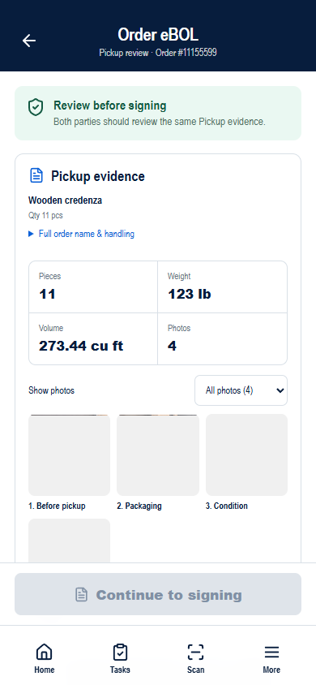
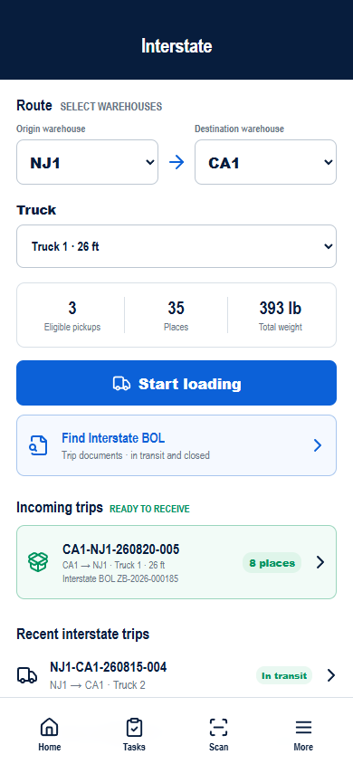

# Руководство пользователя

Руководство описывает **активный** интерфейс Mobile App. Кнопки меняют локальные данные прототипа; загрузка маршрута, работа устройств, подписи, отправка документов и синхронизация являются симуляциями. При выполнении операции сверяйте номер заказа и PlaceID на экране. Для первого знакомства начните с [краткого руководства](quick-start.md).

## Начало работы и навигация

*На Home выберите операцию или откройте остановку загруженного маршрута.*

Первый экран — **Cargo operations**. Крупные кнопки Pickup и Dropoff открывают соответствующую операцию. Карточка **Pre-trip inspection** управляет доступом к **Load today’s route**: маршрут заблокирован до успешного осмотра. Загруженный маршрут показывает локальные остановки Spoke с номером заказа, порядком, временем, типом операции, количеством и адресом. В списке можно искать по External ID. При наличии локальных данных ниже появляются Order documents, черновики Pickup и Recent operations.

Нижнее меню:

| Раздел | Для чего нужен |
| --- | --- |
| **Home** | Открыть Pickup/Dropoff, загрузить остановки, продолжить черновик или открыть Order eBOL. |
| **Tasks** | Найти остановку по номеру/названию заказа, выбрать All/Pickup/Dropoff, открыть операцию или Order details. |
| **Scan** | Найти PlaceID или Order ID и открыть запись груза. Этот раздел не фиксирует загрузку или доставку. |
| **More** | Help & Instructions, Sync now, Cargo places, Interstate operations и Administration. В Administration управляются роль, филиал, сеть, результаты операций, доступность устройств и локальные сценарные данные для показа. |

### Карта активных экранов

Маршруты ниже используются после символа `#` в адресе развёрнутого сайта. Экраны интерактивны в прототипе, но внешние действия и backend имитируются.

| Откуда | Экран и маршрут | Следующий шаг |
| --- | --- | --- |
| Открытие приложения | Cargo operations — `#/` | Pickup, Dropoff, загрузка маршрута, Order documents |
| Home | Pre-trip inspection — `#/pre-trip-inspection` | Чек-лист, пять фото, включая Dashboard и подтверждение водителя |
| Home после Pre-trip | Post-trip inspection — `#/post-trip-inspection` | Состояние автомобиля после использования; просмотр результата и истории |
| Home / нижнее меню | Tasks — `#/tasks` | Операция остановки или Order details |
| Нижнее меню | Scan — #/scan | Запись места или места заказа |
| Home / Tasks / Pickup draft / Order details | Messages — #/communications, #/orders/{number}/communications | Написать клиенту, просмотреть SMS или начать звонок по заказу |
| Нижнее меню | More — `#/more` | Help & Instructions, Interstate, Cargo places, Sync now, Administration |
| Home / Tasks | Pickup draft — `#/pickup?order={number}` | Pickup review или Place labels |
| Tasks / Pickup | Order details — `#/orders/{number}/details` | Возврат к операции |
| Pickup | Place labels — `#/orders/{number}/labels` | Preview/Print, Scan, Pickup review |
| Pickup | Pickup review — `#/orders/{number}/ebol/pickup` | Pickup signing |
| Pickup review | Pickup signing — `#/orders/{number}/ebol/pickup/sign` | Заблокированная запись Pickup |
| Home / Tasks | Dropoff — `#/dropoff?order={number}` | Delivery review или Pickup review |
| Dropoff | Delivery review — `#/orders/{number}/ebol/delivery` | Delivery signing |
| Delivery review | Delivery signing — `#/orders/{number}/ebol/delivery/sign` | Завершённый Order eBOL / POD |
| Завершённый Order eBOL | POD — `#/orders/{number}/ebol/pod` | Версии документа и действия |
| More | Help & Instructions — `/Mobile_app/help/ru/` | Открыть адаптированную для телефона инструкцию; язык меняется в меню документации |
| More | Cargo places — `#/places`; место — `#/places/{PlaceID}` | Статус, местоположение, история |
| More | Interstate — `#/interstate` | Загрузка, входящий рейс, архив BOL |
| Interstate | Loading — `#/interstate/loading` | Review — `#/interstate/review`; Trip — `#/interstate/trip` |
| Interstate | Unloading — `#/interstate/unloading/{TripID}` | Проверка и подтверждение разгрузки |
| Interstate | Архив BOL — `#/interstate/bols`; документ — `#/interstate/bol/{BOL number}` | Просмотр, Save as PDF, Print |

В коде есть старые компоненты Home, Pickup, Dropoff и Same Day, не подключённые к активному роутеру. Они не являются пользовательскими инструкциями. [Источник маршрутов](../../../wireframe/src/App.tsx).

## Предрейсовый осмотр

**Цель:** подтвердить безопасность назначенного автомобиля до загрузки дневного маршрута.

1. На Home найдите карточку **Pre-trip inspection** для **Van 08 · Extended Van** и нажмите **Start** или **Continue**.
2. Проверьте восемь групп: Tires & wheels; Lights & reflectors; Windows, mirrors & wipers; Leaks under vehicle; Body, doors & cargo area; Brakes, steering & horn; Emergency equipment; Company equipment & tools. Для каждой выберите **Pass** или **Issue**.
3. Нажмите **Continue to photos**. Через **Take photo** сделайте Front, Rear, Driver side, Passenger side и Dashboard, сохраняя автомобиль и колёса полностью в кадре. Загрузка из галереи намеренно недоступна.
4. Нажмите **Review inspection**. Если все проверки пройдены, установите **I confirm this vehicle is safe to operate** и нажмите **Complete inspection**.
5. На результате появится **Ready for route**. После возвращения Home карточка покажет **Vehicle cleared**, а **Load today’s route** станет доступной.

Любой **Issue** показывает **Route locked** и блокирует завершение. Нажмите **Review issues** и меняйте результат только после физического устранения проблемы. При **Camera unavailable** необходимо восстановить доступ к камере: галерея не заменяет обязательные фото. Завершённые осмотры доступны только для просмотра. Wireframe хранит текущую пару осмотров и историю; ремонтная задача и supervisor override не реализованы.

## Послерейсовый осмотр

1. После завершения Pre-trip вернитесь на Home и нажмите **Start** в **Post-trip inspection**. Загрузка маршрута не обязательна.
2. Ответьте **Pass** или **Issue** по восьми пунктам, включая **Company equipment & tools**. Для каждого Issue обязательно опишите проблему.
3. Нажмите **Continue to photos** и сделайте **Front**, **Rear**, **Driver side**, **Passenger side**, **Dashboard**. Все пять фото обязательны; галерея недоступна.
4. Нажмите **Review inspection** и установите **I confirm this inspection record is accurate**. При остановках без завершённого handoff отдельно подтвердите, что они остаются незавершёнными и должны быть сообщены диспетчеру.
5. Нажмите **Complete Post-trip**. Дефект не блокирует отчёт: появятся **Completed — issues reported** и **Vehicle needs attention**. Сообщите диспетчеру о проблемах; осмотр сам не отправляет сообщение и не закрывает заказы.
6. **Back to Home** → **Start next vehicle cycle** открывает новый Pre-trip. Предыдущая пара доступна в **Previous vehicle inspections**. Предупреждение напоминает о дефектах предыдущего Post-trip; начало нового цикла не подтверждает ремонт.

Черновики и read-only итоги сохраняются после обновления страницы. При ошибке сохранения проверьте хранилище устройства и повторите действие до ухода со страницы. Фото — локальные маркеры capture, не реальные изображения. Время осмотров не используется для расчёта рабочих часов. В Pre-trip обязательны пять фото с Dashboard; корпоративное оборудование проверяется отдельно от Emergency equipment.

## Tasks и данные заказа

*Найдите заказ по номеру или названию, выберите фильтр и откройте остановку.*

1. После статуса **Vehicle cleared**, если на Home нет списка Today’s stops, выберите **Load today’s route**. Это загрузка локальных образцов, а не подключение к Spoke.
2. Откройте **Tasks**. Ищите Order ID или название либо выберите All, Pickup или Dropoff.
3. Нажмите карточку остановки. Через **Order details · Spoke preview** можно посмотреть название, источник, количество, Special Cargo и доступное только для чтения представление остановки.
4. Для сохранения или подтверждения используйте основную кнопку открытой операции. Само открытие задачи её не завершает.

Текущий список Tasks не показывает универсальный жизненный цикл статуса задачи. Он содержит запланированные остановки; у Pickup, Dropoff и Order eBOL отдельные локальные состояния. Строка задачи не является доказательством назначения или завершения на сервере.

## Team contacts — контакты команды

Откройте **Team contacts** из Pickup/Dropoff для перехода прямо к списку контактов. **Order details** открывает ту же карточку заказа с начала, включая контекст остановки. Карточка показывает диспетчера, брокера и менеджера именно этого заказа, отдельно от контакта клиента. Нажмите **@nickname** для перехода в Telegram; сообщение составляете и отправляете самостоятельно. **Not assigned** означает отсутствие назначенного контакта в этой роли.

Проверьте номер, название, количество, операцию, адрес, время и требования/заметку заказа. При нескольких остановках сначала выберите **Order stop**. Нажмите **Copy order summary** и вставьте текст в сообщение. Если Clipboard заблокирован, выделите и скопируйте показанный **Order summary** вручную. Отсутствующие данные обозначены явно; OTP и подписи не копируются.

Имена и Telegram handles — непроверенные образцы: до внешней демонстрации согласуйте адресаты. Открытие Telegram зависит от устройства/браузера; интеграция мессенджера не подключена.

## Навигация к остановке

На Home в **Today's stops**, Tasks, Pickup/Dropoff или Order details проверьте полный адрес и нажмите **Navigate**. Откроется Google Maps в новой вкладке либо поддерживаемом внешнем приложении; в зависимости от устройства/геопозиции может появиться preview маршрута вместо немедленной навигации. Исходный экран остаётся открытым. Действие не фиксирует прибытие, выполнение остановки или изменение статуса заказа.

**Copy address** копирует полный адрес; кнопка меняется на **Copied** без сдвига содержимого. **Copy order summary** аналогично меняется на **Order summary copied**. Если Clipboard недоступен, выделите показанный текст вручную. При нескольких возможных остановках откройте **Select stop in Order details** и сначала выберите **Order stop**. При отсутствии адреса активной Navigate нет — нажмите **Contact team**, чтобы уточнить назначение.

На Home выезд остаётся заблокированным до допуска Pre-trip или после завершения Post-trip. При переходе из Pickup/Dropoff ошибка сохранения блокирует открытие карт: не закрывайте форму, проверьте storage и повторите. Обычный автомобильный маршрут не гарантирует соблюдение ограничений высоты/массы/коммерческого доступа. Настраивайте навигацию во время безопасной остановки, не за рулём в движении.

## Pickup

*Проверьте заказ, затем прокрутите форму до групп размеров и фотографий.*

**Цель:** зафиксировать полученные места и доказательства состояния, затем подтвердить передачу на этапе Pickup в Order eBOL.

**Когда использовать:** откройте остановку Pickup из Home/Tasks или кнопку Pickup на Home и выберите верный заказ.

1. Проверьте **Order #**, рабочее название и **Order details**. Чтобы связаться с клиентом, не выходя из заказа, нажмите **SMS** в карточке заказа; счётчик на кнопке показывает новые ответы. Если название или данные обработки неполные, откройте Order details и заполните поля, доступные текущей роли.
2. Укажите дату Pickup, ответственного менеджера, упаковку и комментарий к заказу при необходимости.
3. Для каждой **dimension group** введите **Qty**, L/W/H в дюймах и вес одного места в фунтах. Группа объединяет места с одинаковыми характеристиками, но каждое сохраняет собственный PlaceID. При необходимости добавьте или удалите группу. Если величину нельзя определить, отметьте это или оставьте её неизвестной и заполните **Reason for unmeasured values**. Известные итоги отображаются отдельно от неполных мест.
4. Проверьте **Cargo photos**. Добавьте фото через **Take photo** или **Choose from gallery**, выберите категорию и просмотрите миниатюры. Пока форма редактируется, отдельное фото можно открыть и удалить. В прототипе используются локальные образцы и метаданные.
5. Дождитесь состояния сохранённого черновика. Форма сохраняется автоматически и доступна для продолжения с Home. Исправьте **Order data incomplete** и предупреждения об измерениях. **Continue to Pickup review** становится доступной при наличии номера заказа, минимум одного места и фото, обязательных сведений и успешно сохранённого черновика.
6. Выберите **Continue to Pickup review**. На промежуточном экране появится **Pickup draft ready**. При необходимости откройте **Place labels**: выберите все, некоторые или одну этикетку, проверьте preview и нажмите **Print**. Если принтер недоступен, продолжите к review и проверьте PlaceID вручную.
7. Откройте **Pickup review**. Сверьте места, вес, объём, фото, состояние и исключения. Комментарии вводятся при подтверждении, а не на Review. Если данные изменились после проверки, вернитесь и проверьте актуальную версию.
8. Выберите **Sign on device** либо **SMS code** для контакта Pickup. Для SMS code нажмите **Send verification code**, введите полученный от контакта шестизначный код и нажмите **Verify recipient**. В прототипе успешен любой шестизначный код, кроме `111111`; после трёх ошибок проверка блокируется. Укажите имя контакта или водителя, когда форма его запрашивает. Повреждение или иное исключение требует описания.
9. Для подписи на устройстве нажмите **Continue to signing**, после OTP — **Continue to driver signature**. При подписи на устройстве получите подпись контакта, при желании отметьте отправку ему копии этой версии по email и нажмите **Accept contact signature**. При SMS code проверенный OTP заменяет только подпись контакта. Затем получите подпись водителя Zaberman и выберите **Confirm & lock Pickup snapshot**.

**Результат:** Pickup snapshot заблокирован и доступен только для чтения. Дополнительное место оформляется через **Supplemental Pickup** с новой версией документа и новыми подтверждениями. Сохранённый черновик и сообщение **Pickup draft ready** ещё не означают окончательное подтверждение передачи. [Форма](../../../wireframe/src/screens/PickupCaptureScreen.tsx), [review](../../../wireframe/src/screens/PickupEbolScreen.tsx), [подписание](../../../wireframe/src/screens/PickupSignatureScreen.tsx).

## Dropoff

*Сверьте Pickup evidence, затем прокрутите экран до фото Delivery и проверки состояния.*

**Цель:** сверить доставленный груз с Pickup evidence, зафиксировать состояние и подтвердить передачу Delivery.

1. Откройте остановку Dropoff из Home/Tasks либо выберите **Dropoff**, введите номер заказа и нажмите **Search**. Сообщение **Order not found** означает, что для номера нет записи Pickup в текущем локальном состоянии.
2. Проверьте название, число мест, вес, объём, дату Pickup, ответственного менеджера и фото Pickup. Незавершённый Supplemental Pickup необходимо подтвердить подписями до Delivery.
3. Добавьте **Delivery photos** и сравните груз с материалами Pickup.
4. Отметьте **Cargo matches pickup photos** только при фактическом совпадении. Выберите **No visible damage** либо **Report damage instead** и заполните **Damage details**. Задокументированное повреждение не блокирует передачу.
5. Выберите **Confirm Dropoff**. Операция сохраняется локально и подготавливает Delivery evidence. Если Pickup snapshot ещё не заблокирован, сначала воспользуйтесь предложенной кнопкой **Open Pickup review**.
6. Откройте **Delivery review**. Проверьте материалы и исключения, укажите имя водителя и выберите один способ подтверждения контакта:
   - **Sign on device** — укажите имя и получите подпись контакта;
   - **SMS code** — нажмите **Send verification code**, попросите получателя сообщить код с зарегистрированного маскированного номера и нажмите **Verify recipient**. В прототипе успешен любой шестизначный код, кроме `111111`; после трёх ошибок проверка блокируется;
7. Для SMS code переход к подписи остаётся заблокированным до статуса **Recipient verified**. При Offline, истёкшем коде или ошибке доставки используйте предложенный повтор; если проверка заблокирована, обратитесь к диспетчеру и не выбирайте обходной способ самостоятельно.
8. Выберите **Continue to signing** или **Continue to driver signature**. Получите требуемые подписи и нажмите **Complete Order eBOL**.
9. Откройте **View POD**. При SMS code в POD отображаются факт OTP-проверки, имя получателя и только последние четыре цифры номера. Сам код не сохраняется.

**Результат:** на шаге 5 локально подтверждён Dropoff; на шаге 8 завершён Order eBOL. POD — итоговое представление этого документа, а не третий отдельный документ. [Форма Dropoff](../../../wireframe/src/screens/DropoffVerifyScreen.tsx), [Delivery review](../../../wireframe/src/screens/DeliveryEbolScreen.tsx).

## Комментарии при подписании

Правила одинаковы для Pickup, Supplemental Pickup и Delivery:

- Контакт вводит необязательный **Your comment** на своём экране перед подписью. Водитель вводит собственный **Your comment** на экране подписи водителя; комментарий контакта здесь только для чтения.
- Изменение своего комментария очищает свою подпись: подпишите заново. **Edit contact comment · sign again** возвращает к контакту и требует повторного подписания обеими сторонами.
- При **SMS code** слова контакта записываются в **Contact comment (reported)** до проверки кода. После проверки поле блокируется. **Edit contact comment · verify again** или изменение исключения требует новой OTP-проверки. Водитель добавляет свой комментарий перед своей подписью.
- Оба поля необязательные, до 1 000 символов каждое. Черновик сохраняется локально; после обновления страницы текст остаётся, но подписи на устройстве нужно получить заново. При ошибке сохранения не закрывайте экран и повторите попытку до продолжения.
- Комментарии относятся только к текущей версии документа; после завершения они доступны только для чтения. Повреждение или несогласие по-прежнему фиксируется отдельно как исключение.

## Same Day

Принятая модель связывает отдельные Pickup и Dropoff через RouteRun. Активное приложение показывает остановки обоих типов в Today's route, но не имеет доступного экрана прогресса Same Day и подтверждённого автоматического связывания пары. Выполняйте каждую остановку через обычный Pickup или Dropoff. Не считайте, что завершение Pickup автоматически создаёт или завершает задачу Dropoff. [Статья Same Day](../../../knowledge-base/mobile-app/ru/same-day.md).

## Сообщения и звонки клиенту

Откройте **Messages** с Home, **Message customer** из задачи или Order details либо **SMS** в карточке заказа на экране Pickup draft. Каждый диалог относится к одному Order и одному контакту клиента.

1. В **Messages** найдите диалог по номеру заказа, имени клиента или тексту сообщения. Используйте фильтр **All** или **Unread**.
2. Откройте диалог и проверьте клиента, Order и тип операции в заголовке. Отправитель — корпоративный SMS-номер Zaberman **17178361039**; личный номер сотрудника не используется и не показывается.
3. Выберите быстрый текст **On my way**, **Arrived**, **Running late** или **Please confirm access** либо введите своё сообщение. Проверьте текст и нажмите **Send**.
4. Проверьте статус: Sending, Sent, Queued until online или Not sent. Offline-сообщение отправится автоматически после восстановления сети. Для Not sent нажмите **Retry**.
5. Входящий ответ отмечается как непрочитанный в Messages, связанной задаче и на кнопке **SMS**. После открытия диалога счётчик сбрасывается. Кнопка **Open order** возвращает к связанной операции.
6. Чтобы позвонить этому же клиенту, нажмите **Call** в диалоге. Проверьте клиента, Order и номер **Calling from**, затем нажмите **Start call**. Во время соединения доступны **Mute**, **Speaker** и **End call**. После завершения используйте **Call again** или **Back to messages**.

В текущем wireframe SMS и состояния звонка моделируются локально; провайдер телефонии, аудиосоединение, webhook, push-уведомления и production-история коммуникаций не подключены.

## Грузовые места, Scan и этикетки

*Найдите PlaceID или Order ID; основной Scan не фиксирует перемещение.*

**Dimension group** хранит количество и общие размеры/вес; отдельный **PlaceID** сохраняется для каждого физического места. В **More → Cargo places** можно искать по PlaceID, заказу или местоположению и открыть этикетку, статус, текущее расположение и краткую историю места. Этикетки доступны после сохранения Pickup. В прототипе повторная печать сохраняет тот же PlaceID.

Для поиска откройте **Scan**. Используйте **Scan label**, если демонстрационный сканер доступен, либо **Enter code manually**, введите PlaceID/Order ID и выберите **Find**. Найденное место можно открыть; Order ID показывает все известные места заказа. Повторный PlaceID в рамках посещения выводит **Already scanned this visit**. Неизвестный код показывает **Code not found** и ничего не создаёт. Основной Scan только ищет; для загрузки или приёмки используйте поле PlaceID на экране Interstate Loading/Unloading. Этикетка использует Code 128; отдельный QR-процесс не показан. [Источник Scan](../../../wireframe/src/screens/ScanScreen.tsx).

## Фотографии

В активном UI формы Pickup и Dropoff требуют минимум одно фото для основного подтверждения. Редактор предлагает категории **Before pickup**, **After delivery**, **Packaging**, **Condition**, **Damage**, просмотр и удаление при редактировании. Галереи Pickup и Delivery раздельно отображаются в review/POD; у Supplemental Pickup свои фотографии. Действия камеры и галереи сейчас используют встроенные образцы и локальные метаданные. Production-правило обязательных ракурсов или точного содержания кадра прототип не задаёт. [Редактор фото](../../../wireframe/src/PhotoEvidence.tsx).

## Order eBOL, POD и документы

*Проверьте evidence и данные подписантов до перехода к подписанию.*

**Order eBOL** принадлежит одному заказу. Материалы Pickup и Delivery проходят review и блокируются после соответствующих подтверждений. **POD** появляется после блокировки обеих записей. Блок **Order documents** на Home открывает актуальный этап. История версий даёт доступ для чтения к original, Supplemental и Delivery. Диалоги Download, Print, Email и Share показывают локальный результат, но не создают и не отправляют производственный документ. Необязательный запрос email-копии контактом Pickup привязан к конкретной подписанной версии и также имитируется. Показанные подписи не являются юридически значимыми production-подписями. [Журнал решений BOL](../../../BOL_DECISION_LOG.md).

## Interstate и Interstate BOL

*Выберите направление и машину, затем начните загрузку либо откройте входящий Trip.*

1. Откройте **More → Interstate operations**. Выберите разные **Origin warehouse** и **Destination warehouse**, затем машину. Для загрузки подходят только заказы с записанным Pickup в выбранном направлении.
2. Нажмите **Start loading**. Введите PlaceID в **Scan or enter Place ID** и выберите **Load**, либо раскройте заказ и выберите номера мест или **Load all remaining**.
3. Нажмите **Review N loaded places**. Проверьте направление, машину, итоги и строки манифеста. Выберите **Create Trip & BOL**.
4. На итоговом экране показаны TripID и номер Interstate BOL. Откройте BOL либо вернитесь в Interstate. **Find Interstate BOL** открывает архив с поиском и фильтрами статуса; **Save as PDF** и **Print** вызывают диалог печати браузера.
5. Для приёмки откройте рейс в **Incoming trips**. Введите или выберите реально полученные PlaceID, затем **Review unloading**. Если места отсутствуют, подтвердите расхождения. Нажмите **Confirm unloading**.

В прототипе Trip и приёмка — локальные симуляции. Полное физическое перемещение, серверное закрытие и связанная Delivery после разгрузки не показаны. Order eBOL и Interstate BOL — разные документы. [Экран Interstate](../../../wireframe/src/screens/InterstateScreen.tsx), [BOL](../../../wireframe/src/screens/InterstateBolScreen.tsx).

## Завершение операций и проблемы

| Сообщение или состояние | Действие |
| --- | --- |
| Черновик сохраняется / ошибка сохранения | Дождитесь завершения либо оставьте экран открытым, освободите место в браузере и повторите попытку. Не подписывайте несохранённый черновик. |
| Неполные данные заказа или измерения | Откройте Order details или укажите причину неизвестной величины и вернитесь к операции. |
| Order not found при Dropoff | Проверьте номер и наличие записи Pickup в этом браузере. |
| Незавершённый Supplemental Pickup | Продолжите и подпишите новую версию перед Dropoff. |
| Review required | Вернитесь к соответствующему review; прямая ссылка на signing не обходит проверку. |
| Требуется Pre-trip inspection | Откройте карточку на Home и завершите восемь проверок, пять фото, включая Dashboard и подтверждение до загрузки маршрута. |
| Route locked / обнаружен Issue | Не начинайте маршрут. Проверьте проблему и действуйте по процедуре эскалации; supervisor override в wireframe отсутствует. |
| Camera unavailable при Pre-trip | Восстановите доступ к камере; загрузка из галереи не заменяет обязательное фото осмотра. |
| Code not recognized | Проверьте шесть цифр и повторите. В прототипе `111111` всегда ошибочен; после трёх ошибок обратитесь к диспетчеру. |
| Code expired / SMS could not be delivered | Отправьте новый код или повторите SMS. Проверьте подключение; зарегистрированный номер контакта на Pickup и Delivery review не изменяется. |
| Verification locked | Не обходите OTP через другой способ без решения диспетчера/супервайзера. |
| Недоступна камера, сканер или принтер | Используйте доступный ручной ввод PlaceID или продолжите, если это предлагает UI. Реального оборудования нет. |
| Неизвестный или повторный scan | Проверьте этикетку и PlaceID. Поиск не создаёт место и не записывает перемещение. |
| Не хватает места при разгрузке | Сверьте манифест, продолжите приёмку либо явно подтвердите расхождение перед закрытием. |
| Offline, ошибка повтора или конфликт sync | More показывает локальный статус. Повторите при подключении; сценарий конфликта предлагает **Keep local changes**. Это симуляция, а не подтверждение получения сервером. |

Если интерфейс не предлагает решения, не подтверждайте спорную операцию и обратитесь к ответственному за процесс. Порядок такой эскалации прототип не определяет; его должна предоставить ответственная операционная команда.
