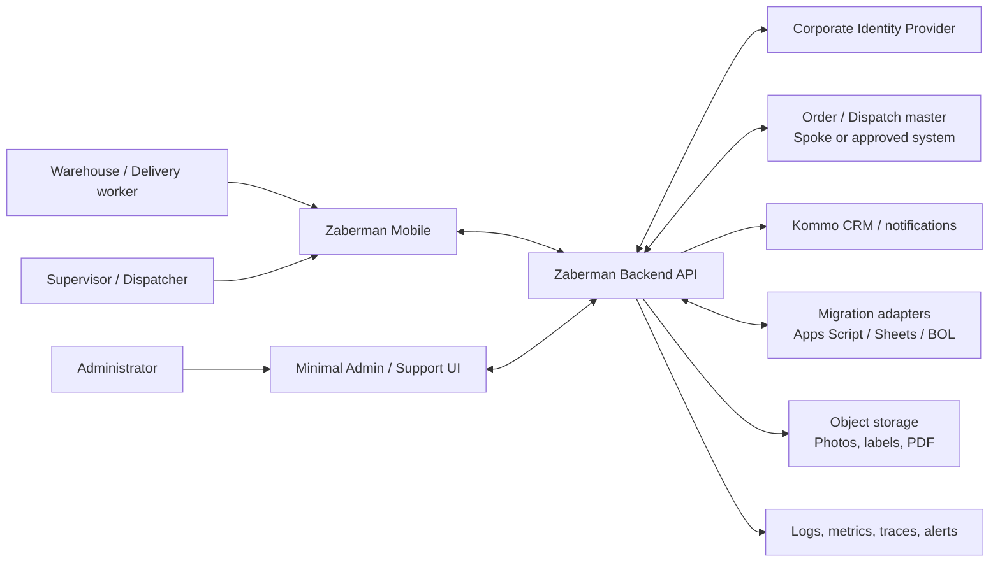
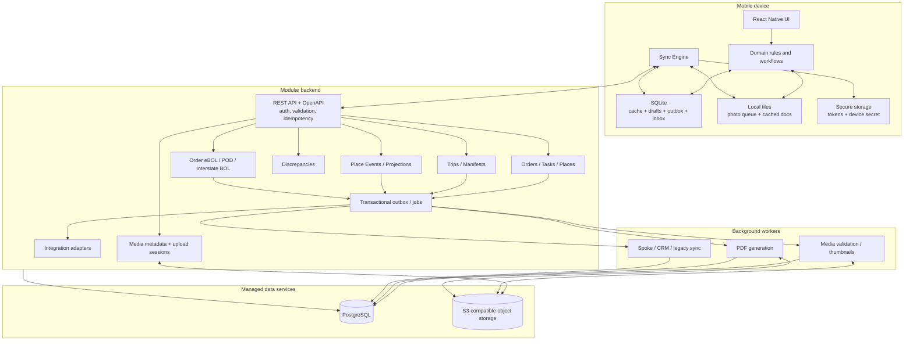
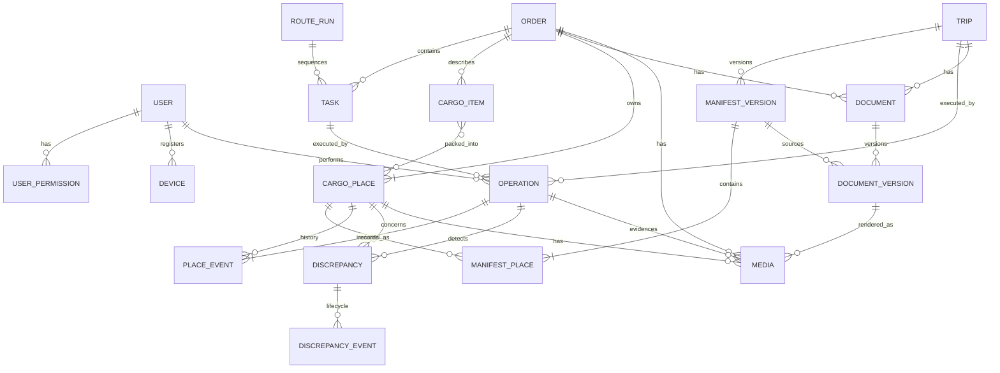
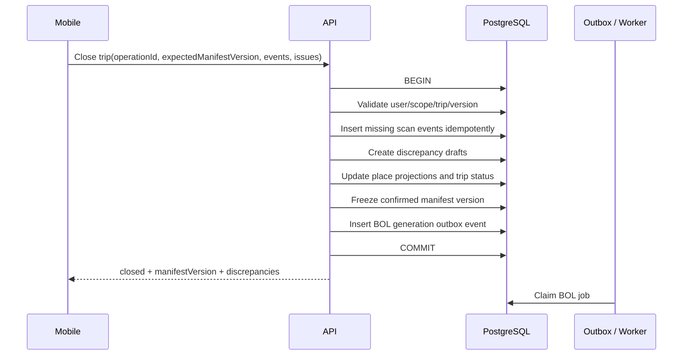
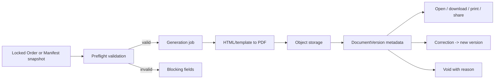
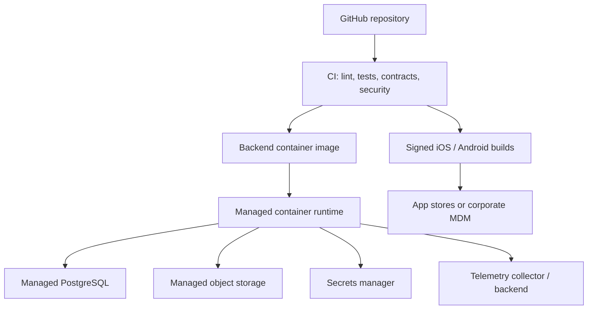

# Целевая архитектура и схемы Zaberman Mobile

Дата синхронизации: 2026-09-01

Статус: рекомендуемая TO-BE схема; DDL и первый NestJS command slice реализованы, runtime PostgreSQL не подтверждён.

Принцип: local-first mobile client + modular backend + transactional system of record.

Фактическая граница реализации и известные расхождения зафиксированы в [CURRENT_STATE.md](CURRENT_STATE.md). Детальная DDL-модель описана в [DATABASE_SCHEMA.md](DATABASE_SCHEMA.md) и migrations в `database/postgres/`.

## 1. Контекст системы



Граница Zaberman: операционные факты по `CargoPlace`, событиям, manifests, discrepancies и документам. Принятое решение PD-014 относит Order/Task/RouteRun к внешнему Order/Dispatch master, а Trip/Manifest — к Zaberman до утверждения TMS master; конкретный внешний system code ещё не выбран.

## 2. Контейнерная схема



### Архитектурное решение

- Один deployable backend с внутренними модулями — рекомендуемый MVP.
- Workers могут быть отдельными процессами того же codebase.
- Redis/BullMQ добавляется только при доказанной необходимости; сначала достаточно PostgreSQL transactional outbox и job table.
- Object storage хранит binary; PostgreSQL хранит metadata и связи.
- Mobile никогда не обращается напрямую к Sheets/Drive/CRM.

В текущем репозитории есть минимальный backend slice `Create CargoPlace`; workers, SQLite client и object storage отсутствуют. SQL migrations и source-транзакция не означают, что контейнерная схема уже развёрнута или runtime-проверена.

## 3. Доменные границы

| Модуль | Ответственность | Не отвечает за |
|---|---|---|
| Identity & Access | users, devices, permissions, scopes | бизнес-статусы операций |
| Orders & Tasks | cache/master references, assignments, Pickup/Dropoff lifecycle | interstate manifest |
| Cargo | Item, Place, measurements, label aliases, current projection | документы рейса |
| Events & Sync | idempotent operations, append-only events, sync result | UX state |
| RouteRun | local and Same Day task sequence | Interstate Loading/Unloading |
| Trips & Manifests | Trip, expected/confirmed manifest versions | Order eBOL |
| Discrepancies | missing/extra/damaged/wrong trip lifecycle | автоматическое изменение факта |
| Documents | Order eBOL, POD view, Interstate BOL versions | изменение warehouse fact |
| Media | upload, metadata, checksum, retention | бизнес-решение о damage |
| Integrations | mapping, retries, reconciliation | владение внутренними доменными правилами |

## 4. Модель данных



### Ключевые идентификаторы

| Поле | Рекомендация | Причина |
|---|---|---|
| Internal IDs | UUIDv7 | Генерация в распределённой/offline среде и временная упорядоченность |
| `operationId` | UUID, unique | Идемпотентность sync mutations |
| `PlaceID` | UUIDv7 + immutable | Глобальная идентичность физического места |
| Human label | `ZB-{short readable code}` + Order `n/N` | Быстрый ручной fallback; не использовать как единственный PK |
| `TripID` | UUID PK + отдельный human trip number | Убрать minute collision и логику даты из ID |
| Document number | Server sequence/business format | Отдельно от internal UUID и TripID |
| Entity version | Integer or ETag | Optimistic concurrency и conflict detection |

Payload barcode содержит только стабильный opaque `PlaceID` и schema/version marker. Изменяемые business attributes не кодируются в label.

## 5. События и projection

Минимальные типы `PlaceEvent`:

- `place_created`;
- `measurement_recorded`;
- `label_printed`, `label_replaced`;
- `pickup_completed`, `pickup_reversed`;
- `trip_assigned`, `loaded`, `load_reversed`;
- `unloaded`, `unload_reversed`;
- `dropoff_completed`, `dropoff_reversed`;
- `damage_reported`, `location_changed`.

Каждое событие содержит:

```text
eventId, operationId, placeId, operationId/entityId, eventType,
occurredAt, receivedAt, userId, deviceId, warehouseId,
payload, reason, source, entityVersion
```

Текущие `status` и `location` — server projections. Correction создаёт новое событие, а не удаляет исходное.

## 6. Синхронизация mutation

```mermaid
sequenceDiagram
    actor User
    participant UI as Mobile UI
    participant DB as SQLite / Outbox
    participant Sync as Sync Engine
    participant API as Backend API
    participant PG as PostgreSQL

    User->>UI: Scan PlaceID
    UI->>DB: Save operation(operationId, occurredAt)
    DB-->>UI: saved_on_device
    UI-->>User: Immediate accepted/pending feedback

    Sync->>DB: Read next dependency-ready operation
    Sync->>API: POST mutation + operationId + expectedVersion
    API->>PG: BEGIN; check permission/idempotency/version

    alt First valid request
        API->>PG: Insert event + update projection + outbox
        API->>PG: COMMIT
        API-->>Sync: confirmed + serverVersion
        Sync->>DB: Mark synced, merge result
    else Duplicate operationId
        API-->>Sync: Return original result
        Sync->>DB: Mark synced
    else Version/business conflict
        API-->>Sync: 409 + server state + resolution options
        Sync->>DB: Mark needs_review
    else Temporary failure
        API-->>Sync: retryable error
        Sync->>DB: Schedule retry with backoff
    end
```

### Порядок зависимостей

`create place → media upload metadata → pickup completion → trip assignment → load/unload → close → BOL request`.

Не следует отправлять dependent operation, пока prerequisite не подтверждён или пока API не поддерживает атомарную batch-команду.

## 7. Atomic Close Loading/Unloading



Если transaction не committed, mobile остаётся в `ready_to_close`/`retry`, а не показывает `closed`.

## 8. Документы



### Разделение

- Order eBOL связан с `Order`, Pickup snapshot и Delivery snapshot.
- POD — final view/version завершённого Order eBOL, а не отдельная competing lifecycle entity.
- Interstate BOL связан с `Trip` и immutable `ManifestVersion`.
- External/customer BOL, загруженный на Pickup, — `Media/ExternalDocument`, а не generated Interstate BOL.

## 9. API boundary

Рекомендуемый REST boundary; точные payload фиксируются OpenAPI.

```text
POST /auth/device/register
GET  /me/context

GET  /tasks?date=&branch=&cursor=
GET  /tasks/{taskId}
GET  /orders/{orderId}
GET  /places/{placeId}
GET  /places/{placeId}/history
POST /cargo-places

POST /sync/operations
GET  /sync/changes?checkpoint=

POST /pickup-operations
POST /pickup-operations/{id}/complete
POST /dropoff-operations
POST /dropoff-operations/{id}/complete

GET  /trips?status=&warehouse=&cursor=
GET  /trips/{tripId}/manifest
POST /trips/{tripId}/load-events
POST /trips/{tripId}/unload-events
POST /trips/{tripId}/close-loading
POST /trips/{tripId}/close-unloading

POST /discrepancies
POST /discrepancies/{id}/transitions

POST /media/upload-sessions
POST /media/{id}/complete

POST /documents/generation-requests
GET  /documents/{id}
POST /documents/{id}/corrections
POST /documents/{id}/void
```

Реализованный контракт первого slice: [`backend/openapi.yaml`](../../backend/openapi.yaml). Остальные endpoints в списке остаются TO-BE boundary.

Каждая mutation принимает `operationId`; entity-changing request — также `expectedVersion`. Bulk sync endpoint возвращает результат по каждой операции, а не один общий success.

## 10. Integration boundaries

| Интеграция | Направление | Рекомендуемый механизм | Failure policy |
|---|---|---|---|
| Order/Dispatch/Spoke | В основном inbound tasks/orders; status outbound | Versioned REST/webhook + reconciliation | Cached data, retry, stale marker |
| Kommo | Outbound structured facts/doc links | API/webhook; Telegram message только transition fallback | Outbox, retry, dead-letter/support |
| Legacy Loading/BOL | Временно в обе стороны по утверждённому ownership | Adapter service; не mobile direct | Idempotency + reconciliation report |
| Identity Provider | Auth inbound | OIDC/OAuth2 | First login online; cached limited session |
| Object storage | Mobile via signed upload; backend metadata | Short-lived signed URLs | Resumable/retry; operation can stay attention |
| Printers | Device-local | System print first; vendor SDK adapter after pilot | Save label/manual fallback |

## 11. Deployment view



Минимум сред: `dev`, `staging`, `production`. Production data и credentials не используются в preview environments.

## 12. Архитектурные решения, которые нужно оформить ADR

1. Master system для Order, Task, RouteRun, Trip и Vehicle.
2. React Native/Expo managed development build против bare React Native.
3. UUIDv7/PlaceID и human label format; Code 128/QR policy.
4. SQLite schema, migrations и optional encryption requirements.
5. Sync protocol, checkpoint, batching, dependency order и conflict responses.
6. Authentication provider, offline session TTL и device management.
7. Photo requirements, compression, upload, retention and privacy.
8. BOL/eBOL legal signature, correction, void and retention.
9. Printer/scanner supported matrix and fallback.
10. Migration ownership, dual-run and cutover.
