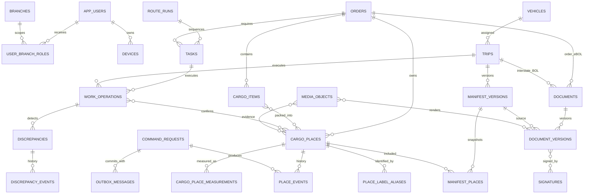

# Схема базы данных

Дата синхронизации: 2026-09-01

Статус: DDL и первая command transaction в рабочем дереве; migrations ещё не применены и не проверены на runtime PostgreSQL 16.

## 1. Решение

Рекомендуемая серверная БД — PostgreSQL 16+. Она является источником истины для `CargoPlace`, событий движения, складских операций, рейсов/манифестов, расхождений и версий документов. `Order`, `Task` и `RouteRun` хранятся как локальная operational-копия данных внешней master-системы.

DDL baseline: [`database/postgres/001_initial_schema.sql`](../../database/postgres/001_initial_schema.sql). Опциональная изоляция чтения по филиалу: [`database/postgres/002_api_context_rls.sql`](../../database/postgres/002_api_context_rls.sql).

Минимальный готовый результат покрывает основной путь:

`Order → Pickup → CargoPlace → Label → Loading → Trip/Manifest → Unloading → Dropoff/POD`, включая offline sync, конфликты, доказательства и аудит.

## 2. Принятые допущения

- Приложение работает для одной компании. Если продукт станет multi-tenant SaaS, `organization_id` нужно добавить во все бизнес-агрегаты до первого внешнего клиента.
- UUIDv7 создаётся мобильным клиентом или API. Так один `PlaceID` и `operationId` сохраняются при offline-повторах.
- Мобильный клиент не подключается к PostgreSQL напрямую. Он работает через API и локальную SQLite-базу.
- Файлы не хранятся в PostgreSQL: фото, PDF и графические подписи находятся в S3-compatible object storage.
- Текущий статус/локация места — изменяемая проекция для быстрых экранов; бизнес-история — неизменяемые события.
- Справочники ролей и permissions заполняются после утверждения матрицы доступа, а не жёстко зашиваются в первую миграцию.

## 3. Логическая ER-схема

## 4. Группы таблиц

| Контур | Основные таблицы | Назначение |
|---|---|---|
| Доступ | `app_users`, `devices`, `branches`, `roles`, `permissions`, `user_branch_roles` | Пользователь, устройство, роль и scope филиала |
| Внешние задания | `orders`, `tasks`, `route_runs` | Operational-копия master-данных с external ID и source version |
| Груз | `cargo_items`, `cargo_places`, `cargo_item_places` | Состав заказа и стабильные грузовые места |
| Атрибуты места | `cargo_place_measurements`, `place_label_aliases` | История размеров/веса и замены labels |
| Выполнение | `work_operations`, `operation_places`, `place_events` | Pickup, Dropoff, Loading, Unloading и фактическая история |
| Рейсы | `vehicles`, `trips`, `manifest_versions`, `manifest_places` | Рейс и неизменяемые expected/confirmed манифесты |
| Отклонения | `discrepancies`, `discrepancy_events` | Missing, extra, damaged, wrong trip, unknown code и resolution |
| Документы | `documents`, `document_versions`, `document_snapshots`, `signatures` | Order eBOL/POD, Interstate BOL, корректировки и подписи |
| Медиа | `media_objects` и четыре link-таблицы | Метаданные объекта, checksum, retention и строгие FK-связи |
| Sync/API | `command_requests`, `device_sync_checkpoints`, `outbox_messages` | Идемпотентность, optimistic concurrency, delta sync и публикация событий |
| Интеграции/аудит | `integration_entity_links`, `integration_attempts`, `audit_log` | Маппинг внешних ID, retry/error trail и security audit |

## 5. Как хранится CargoPlace

Требования прототипа покрываются без сборки экрана из неструктурированного JSON:

| Поле интерфейса | Источник |
|---|---|
| стабильный `PlaceID` | `cargo_places.id` — непрозрачный UUIDv7 |
| Order | `cargo_places.order_id → orders.order_number` |
| номер `n/N` | `place_number` и неизменяемый `place_count_at_creation` |
| размеры | текущая запись `current_measurement_id → cargo_place_measurements` |
| вес и источник | `weight`, `weight_unit`, `weight_source` измерения |
| label | `human_label`; история печати/замены в `place_label_aliases` |
| current location/status | проекция в `cargo_places` |
| короткая история | последние строки `place_events` по `occurred_at desc` |

Для API уже созданы read-модели:

- `cargo_place_current_v` — карточка места одним запросом;
- `cargo_place_history_v` — аудит событий с пользователем и филиалом.

Barcode содержит только версию формата и opaque `PlaceID`. Order, размеры, вес, статус и маршрут в barcode не кодируются, потому что они могут измениться.

## 6. Ключевые ограничения целостности

1. `PlaceID` и `command_requests.id` не переиспользуются.
2. `(order_id, place_number)` уникален; `n` не может быть больше зафиксированного `N`.
3. Одна API-команда имеет уникальный `operationId`; `request_hash` позволяет выявить повтор ID с другим содержимым.
4. Версия события уникальна внутри CargoPlace. Обновление/удаление `place_events` запрещено trigger-ом.
5. Измерения не перезаписываются: корректировка создаёт новую запись с `supersedes_measurement_id`.
6. Pickup/Dropoff operation обязан ссылаться на Task; Loading/Unloading — на Trip.
7. Подтверждённый manifest и его состав неизменяемы. Исправление создаёт новую версию.
8. Issued/void document version неизменяема. PDF связан с checksum и immutable source snapshot.
9. Фото и PDF имеют уникальный storage key и SHA-256; binary content остаётся вне БД.
10. Foreign keys не используют каскадное удаление бизнес-фактов. Удаление заменяется статусом, void/reversal или retention-процессом.

Составные foreign keys дополнительно гарантируют, что current measurement принадлежит тому же CargoPlace, current document version — тому же документу, а подтверждённый manifest — тому же Trip. Сервисная транзакция всё ещё обязана проверить тип loading/unloading manifest и соответствие `current_trip_id` последнему событию движения.

## 7. Транзакционные сценарии

### Создание CargoPlace

Одна транзакция:

1. вставляет `command_requests`;
2. создаёт `cargo_places` и первое измерение;
3. создаёт label alias;
4. добавляет `place_created`, `measurement_recorded`, `label_printed`;
5. обновляет current projection/version;
6. добавляет `outbox_messages`;
7. фиксирует `result_payload` команды.

Если `operationId` уже существует и hash совпадает, API возвращает сохранённый результат. Если hash отличается — возвращает `409 idempotency_key_reused`, не перезаписывая исходную команду. При несовпадении `expected_version` сохраняется `conflict` без изменения доменных данных.

### Закрытие Loading/Unloading

Сервер в одной транзакции блокирует Trip, сверяет `expected_manifest_version`, фиксирует результаты сканирования, создаёт discrepancies, добавляет place events, строит confirmed manifest snapshot и переводит operation из `ready_to_close` в `closed`. Offline-клиент не устанавливает финальный `closed` самостоятельно.

### Коррекция

Коррекция создаёт compensating event, новое измерение/manifest/document version и сохраняет reason/actor/time. Старый факт не удаляется.

## 8. Безопасность и персональные данные

- Доступ пользователя определяется не одной строкой role, а ролью в конкретном филиале.
- `002_api_context_rls.sql` ограничивает read-only соединение доступными филиалами. API передаёт user ID только после проверки токена.
- Командная запись остаётся через backend domain service; прямой write с мобильного устройства запрещён.
- `signer_name`, email, адреса, подписи и фото считаются PII. Их экспорт и просмотр записываются в `audit_log`.
- Object storage использует private buckets и короткоживущие signed URLs.
- Сроки хранения должны быть утверждены юридически; до этого `retention_until` хранится, но физическое удаление не автоматизируется.

## 9. Локальная SQLite-модель

SQLite не копирует весь PostgreSQL DDL. Для mobile MVP достаточно:

- cached `orders`, `tasks`, `cargo_places`, `trips`, expected manifests;
- `pending_commands` с `operationId`, `expectedVersion`, payload, attempts и last error;
- `pending_media` с local URI, checksum и upload state;
- `sync_checkpoint`;
- компактный `place_events` cache для offline UI.

Сервер всегда решает конфликт и возвращает canonical projection. Полный reset mock-данных Dev-панели очищает только prototype/local storage и не является production API-функцией.

## 10. Решения до production rollout

| Решение | Почему блокирует production | Рекомендация |
|---|---|---|
| Master-система для Order/Task/RouteRun/Trip | Определяет ownership и правила reconciliation | Зафиксировать system code, immutable external ID и source version для каждой сущности |
| Матрица role × permission × branch | Нужна для write policies и supervisor overrides | Утвердить 4–6 ролей и разрешения по операциям, не по экранам |
| Юридический статус eBOL/POD | Определяет подпись, retention и audit evidence | Провести legal review до внешнего пилота |
| Retention/PII policy | Без неё нельзя безопасно удалять файлы и персональные данные | Утвердить сроки по типу документа/медиа и legal hold |
| Multi-company roadmap | Позднее добавление tenant boundary дорого и рискованно | Если второй клиент возможен в ближайшие 12 месяцев, добавить `organization_id` до миграции production данных |

## 11. Рекомендуемый порядок реализации

1. Поднять PostgreSQL и применить `001_initial_schema.sql` в CI/test окружении.
2. Выполнить подготовленный integration test транзакции `Create CargoPlace` и идемпотентного replay.
3. Подключить текущую карточку и историю к двум готовым views.
4. Реализовать Loading close с immutable manifest version и discrepancy creation.
5. Добавить document version generation и object-storage upload.
6. После утверждения access matrix — grants и write RLS policies; затем нагрузочные и recovery-тесты.

## 12. Проверка и открытые расхождения

Документ, SQL и первый command slice сопоставлены статически. До runtime-использования обязательны:

1. применить обе migrations к чистому PostgreSQL 16 и проверить rollback транзакции при ошибке;
2. добавить database tests для FK/check constraints, append-only triggers, locked manifests/documents и RLS;
3. добавить PD-012 projections `movement_type` в будущие Task/RouteRun read API; каноническое поле Order уже реализовано;
4. проверить на PostgreSQL constraints PD-011 для nullable measurements, quality state и reason; DDL/API уже реализованы;
5. утвердить role × permission × branch matrix до write grants/policies;
6. подтвердить master systems и external ID/version contracts для Order, Task, RouteRun и Trip.

Нормативные правила PD-001–PD-014 описаны в [STAGE_0_PRODUCT_DECISIONS.md](STAGE_0_PRODUCT_DECISIONS.md), а реализация первого сценария — в [STAGE_1_CREATE_CARGO_PLACE.md](STAGE_1_CREATE_CARGO_PLACE.md). До выполнения перечисленных технических пунктов схему нельзя считать production-ready или источником подтверждённого runtime поведения.
